# Tail Recovery

### Abstract

We use extreme value theory to study idiosyncratic tail risk for a large panel of U.S. stocks. Surprisingly, calls (respectively, puts) contain important information about lower (respectively, upper) tails, and [...] high out-of-the-money call (put) prices negatively predict upper (lower) tail risks. Finally, our analysis emphasizes the importance of big data in the efficient estimation of non-linear predictive models: A linear (LASSO) model matches the performance of deep neural networks on a smaller sub-sample (S\&P500 stocks), while on the extended dataset (about 6,000 stocks), the non-linearity of the neural network translates into higher out-of-sample predictability.

## Data Description
-----
The dataset covers 5349 U.S. public firms from 2007-01-03 to 2020-09-28 and contains data for options bids, asks, volume, open interest, implied volatilities, as well as the price of the underlying asset .

All data are originally pulled from [ORATS - Options Research & Technology Services](https://www.orats.com).

In particular, we use the following [ORATS](https://www.orats.com) resources:

1. [Historical options quotes and greeks](https://blog.orats.com/historical-options-quotes-and-greeks)
2. [Companies' dividends calendar](https://docs.orats.io/datav2-api-guide/data.html#dividend-history)
3. [Companies' earning calls calendar](https://docs.orats.io/datav2-api-guide/data.html#dividend-history)
4. [Companies' stock split history](https://docs.orats.io/datav2-api-guide/data.html#stock-split-history)

To recreate the train and test sets please run:

```bash
./scripts/create_datasets.sh
```

Before running the script, make sure to export $DATASET a variable pointing to your [ORATS](https://www.orats.com) data and that has the following folder structure:

```bash
$DATASET
├── raw_option_data
└── underlyings_info
    ├── business_days_to_maturity.csv
    ├── orats_dividends.csv
    ├── orats_earnings.csv
    ├── orats_price_history.csv
```

Where ```raw_option_data``` is a directory that contains a CSV file for each company option quotes pulled from (1). ```orats_price_history.csv``` is created using the *stkpx* field from (1) and adjust the close price using (4). Also, we compute options' monenyness using calendar business days to maturity, see ```create_datasets/create_bdays_to_maturity.py```. Finally, ```orats_dividends.csv``` and ```orats_earnings.csv``` are retrieved from (2) and (3), respectively. 
### Data Description
------------------

| 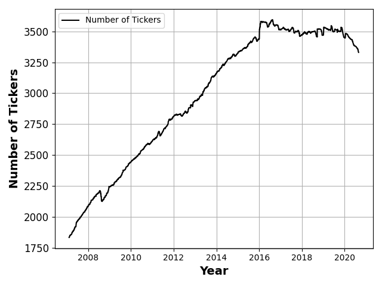<center>(a) Firms</center> | 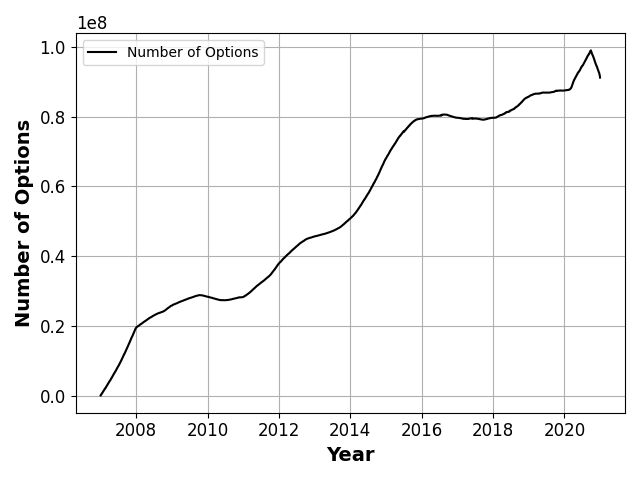<center>(b) Options</center> | 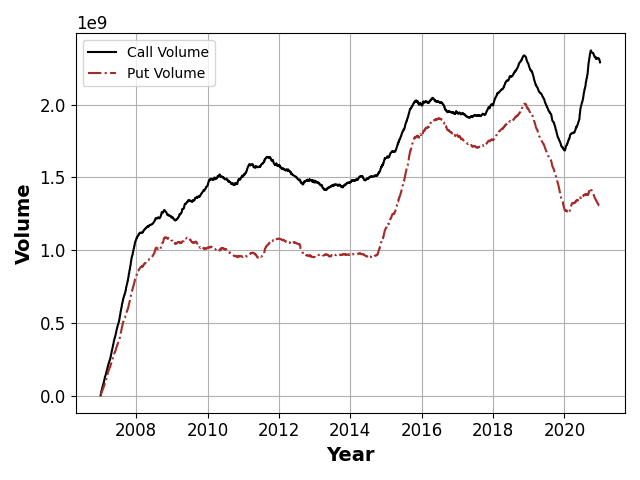<center>(c) Volume</center>  
|-----------------------------------|-------------------------------------|------------------------------|

The figures above describe the evolution of our dataset size and composition across time. Panel (a) shows the total number of different firms. Panel (b) shows the daily number of distinct options, while panel (c) shows the daily volume of the number of contracts for put options and call options. We smooth all results with a 12-month rolling average.

## Extreme Value Theory
----------

[Balkema and De Haan (1974)](https://projecteuclid.org/journals/annals-of-probability/volume-2/issue-5/Residual-Life-Time-at-Great-Age/10.1214/aop/1176996548.full) and [Pickands (1975)](https://projecteuclid.org/journals/annals-of-statistics/volume-3/issue-1/Statistical-Inference-Using-Extreme-Order-Statistics/10.1214/aos/1176343003.full) state that the distribution of tail risk exhibits a power law beyond a sufficiently high threshold. Formally there exists a sufficiently high threshold $u$ such that the distribution $P(R-u|R>u)$ of returns $R$ in excess of $u$  is approximately given by a Generalized Pareto Distribution (GPD)

$$
P(R - u\leq x|R> u)\ =\ 1-\left(1\ +\ x\,\frac{\xi}{\sigma}\right)^{-1/\xi}
,$$

for some $\sigma>0$ (the scale parameter) and $\xi\in \mathbb{R}$ (the shape parameter). In this paper, we work with log exceedances, $\log(R-u),$ that has an exponential GPD (exGPD) density


$$g_{(\xi,\sigma)}(y)=\begin{cases} \frac{e^{y}}{\sigma}\left(1+\frac{\xi e^{y}}{\sigma}\right)^{-1 / \xi-1} & \text { for } \xi \neq 0 \\\\\\ \frac{1}{\sigma} e^{y-e^{y} / \sigma} & \text { for } \xi=0 \end{cases},$$

with a support on the whole $\mathbb{R}$.

## Extreme Returns
------

We define our sample of extreme returns as

$$y_{i,t+1}\ \equiv\ \begin{cases} \log(R_{i,t+1} - \hat u_{i,t})  & \text{ if } R_{i,t+1} > \hat u_{i,t}  \\\\\\ \log(-R_{i,t+1} - \hat u_{i,t}) & \text{ if } R_{i,t+1} < -\hat u_{i,t}  \\\\\\ \text{not selected} & \text{ if } |R_{i,t+1}| < \hat u_{i,t} \end{cases},$$

where $\hat u_{i,t} = 2\,\hat v_{i,t}$, and

$$
\hat v_{i,t} = \sqrt{\frac{1}{n-1} \sum_{j=1}^{n} R_{i,t-j+1}^2},
$$

the historical volatility stock $i$ at day $t$. In other words, we define an extreme return, or a *tail return*, as roughly a "*two-sigma*" event.
## Maximum (Log) Likelihood Estimation
------------


| <center>(b) Negative events</center> | 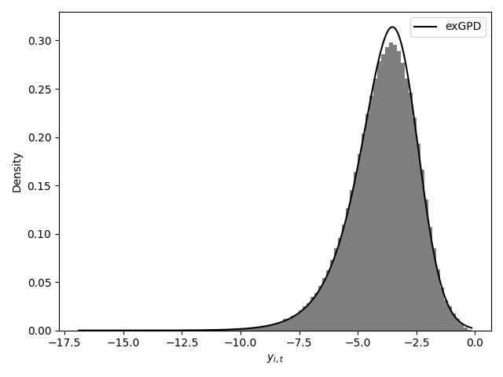<center>(b) Positive events</center>  
|-----------------------------------|-------------------------------------|

The figures above show the distribution of the log exceedances $y_{i,t}^\pm$. Panel (a) shows the distribution of extreme negative events, while panel (b) shows the distribution of extreme positive events. In both figures, we show a histogram of the realized distribution and the PDF of an exGPD estimated through maximum likelihood on the whole sample. The parameters of the estimated distributions are given by $\xi_-=0.389, \sigma_-=0.037$ for the negative events, and $\xi_+=0.362, \sigma_+=0.030$ for positive events.

## Forecasting Tail Events, Backward Looking Measures, and Forward Looking Measures
------------------

To predict tail risk at the weekly horizon, two sets of predicting variables or features:


1. We define eleven distinct *backward-looking* $X^{(b)}_{i,t}$ features: a) three historical moments: standard deviation, skewness, and kurtosis, which we estimate over three different rolling time windows: one week, one month and one year for a total of nine different predictors, and b) a variable containing the numbers of days until the next earning announcement, c) a variable including the number of days until the next dividend.

2. *Forward-looking* predictors, $X^{(f)}_{i,t},$ use options' implied volatilities. For the construction of these features, please refer to the PAPER.

<p align="center">
 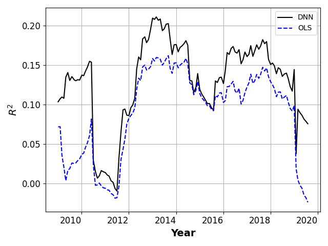
</p>


The figure above shows the out-of-sample $R^2$ performance of a simple OLS trained using *backward-looking* features, in blue, and  the out-of-sample $R^2$ performance of a DNNtrained using *forward-looking* features, in black. 

## Non-linearities and Big Data

------------------
| 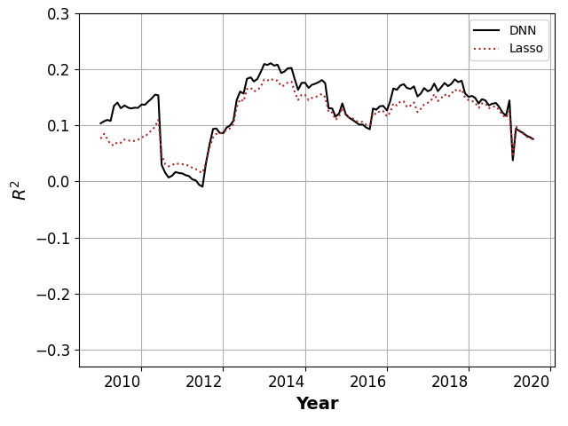<center>(a)</center> | 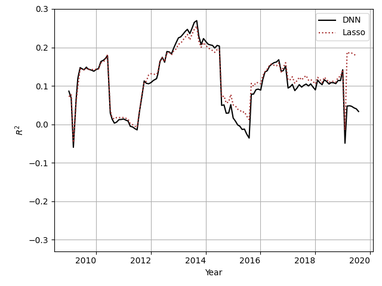<center>(b)</center>
|-----------------------------------|-------------------------------------

The figures above show a comparison between our two forward-looking models, namely DNN and LASSO. In both figures, we show on the x-axis the dates, while the y-axis represents each model performance with the out of sample $R^2$. Panel (a) show the performance when the models are trained and tested on the full sample, while panel (b) shows the performance when the models are trained and tested on the subsample of S\&P500 stocks. These two figures illustrate that the DNN outperforms on average the LASSO model when the data set is large enough, thus showing that the optimal mapping between forward-looking features and tail risk is significantly non-linear. However, the fact that the DNN outperforms the Lasso only when trained on the large subsample illustrates that a large amount of data is necessary to capture this non-linear pattern. (a) $R^2$ values, DNN: 0.120,  Lasso: 0.110. (b) $R^2$ values, DNN: 0.085, Lasso: 0.128.

------------------

<p align="center">
 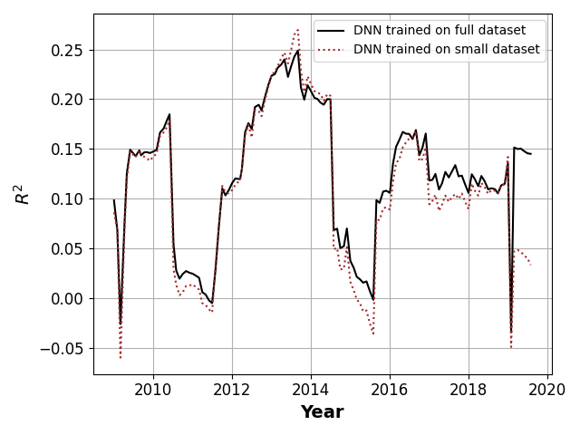
</p>

The figure above shows that the large sample allows the DNN to find a non-linear pattern. We show the out-of-sample $R^2$ of the two network models, one on the large sample, and the other on the small sample of stock belonging to the S\&P500. We measure the $R^2$ of both models on the small subsample of stocks. The overperformance of the model trained on the large subsample shows that access to a larger amount of training data allows the neural network to capture non-linear patterns useful to predict tail risk on both the large and the small datasets. $R^2$ values, DNN on the full dataset: 0.120, DNN on the small dataset: 0.085.


## Tail Risk During Earnings Announcements
------------------
| 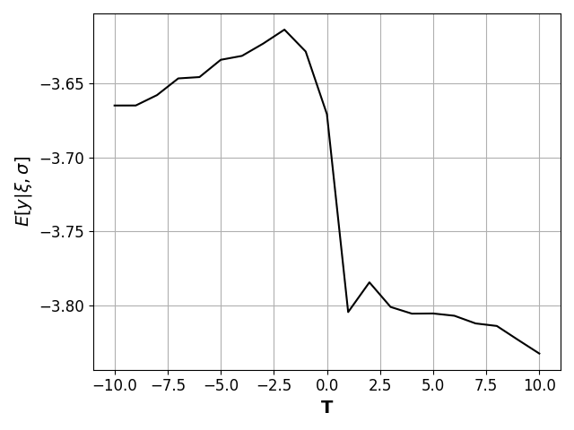<center>(a)</center> | 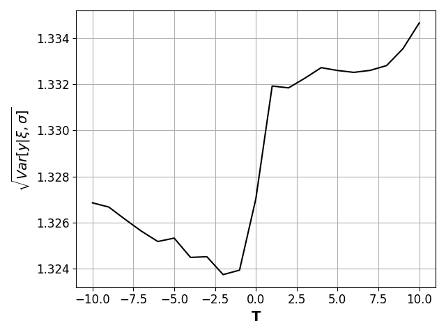<center>(b)</center>
|-----------------------------------|-------------------------------------

The figures above show average predicted mean $E[y | \xi, \sigma]$ and predicted standard deviation $\sqrt{Var[y | \xi, \sigma]}$ of a **negative** tail event. We define t=0 as the day on which earnings are announced. We compute the average of the DNN's forecasted moments across all assets and time periods.

------------------
| 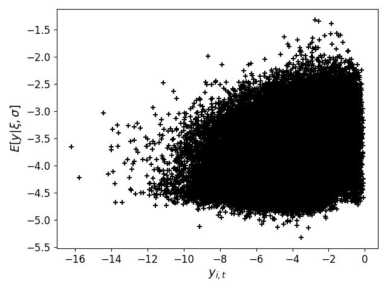<center>(a) Full tail events</center> | 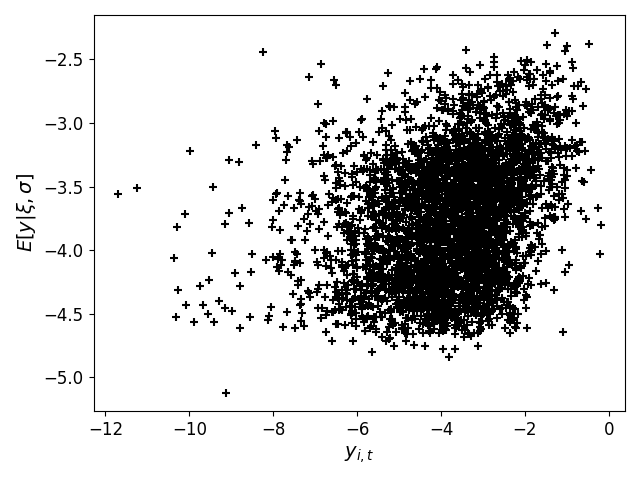<center>(b) Earnings only</center>
|-----------------------------------|-------------------------------------


The figures above show scatter plots of the average predicted mean of a **negative** tail event $E[y | \xi, \sigma]$ against the realized exceedances on days with a negative tail event. Panel (a) shows this projection on the full sample (correlation: 0.35), while panel (b) shows this projection on the subsample of tail events occurring on an earning announcement day (correlation: 0.296).


## Which Features Matters?
------------------
For both negative and positive tails, we investigate the relative importance of
each feature. Following [Gu et al. (2020)](https://academic.oup.com/rfs/article/33/5/2223/5758276), we compute the reduction in $R^2$ from setting all values of a given feature to zero within each test sample. Formally, we define the importance of feature $j$ as,

$$ IMP(j) = |R^2(f(X))-R^2(f(\tilde{X}_j))|, $$

$X$ is the matrix of inputs, and $\tilde{X}_j$ is similar to $X$ except for columns $j$ which is set to $0$.

| 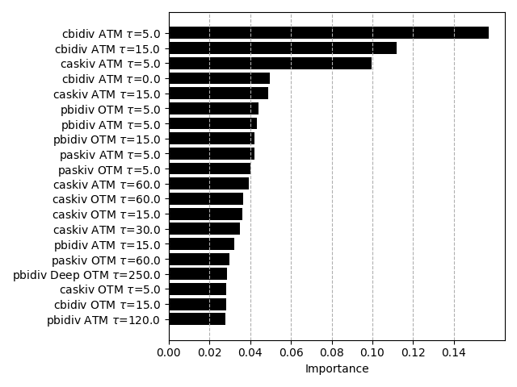<center>(a)</center> | 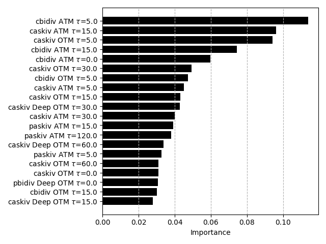<center>(b)</center>
|-----------------------------------|-------------------------------------


The figures above show the normalized features importance ($\hat{IMP}(j)$ of the top 20 important features for DNNs predicting negative tail (panel (a)) and positive tail (panel (b)).

## Non-Linearity
------------------
| 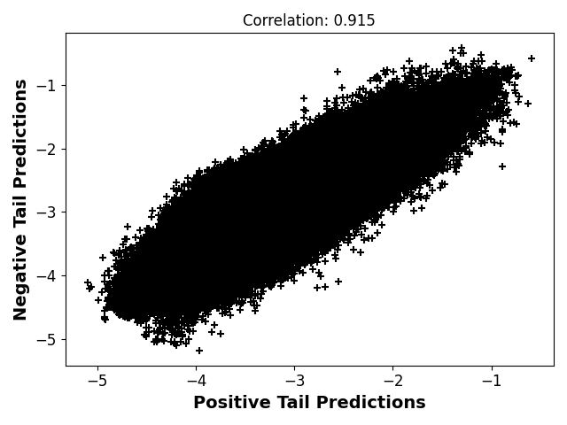<center>(a)</center> | 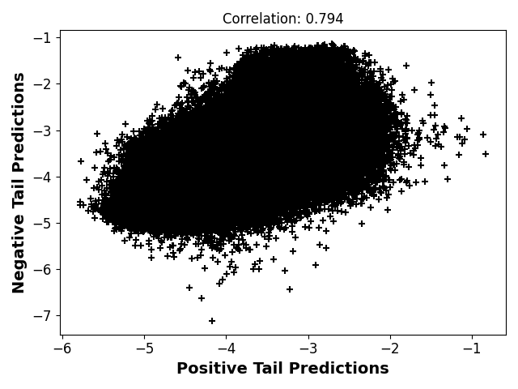<center>(b)</center>
|-----------------------------------|-------------------------------------

The figures above show scatter plots of the predicted mean of a negative tail risk event $E[y^-|\xi, \sigma]$ against the predicted mean of a positive tail risk event $E[y^+|\xi, \sigma]$. Panel (a) for the Lasso and Panel (b) for the DNN. Panel(b) shows that the DNN is able to distinguish more between negative and positive tail events compared to Lasso. 

## How to Reproduce the Results
-------
Run:
```bash
./run_full_paper.sh
```

## Acknowledgments
---------
First Version: February 2021. I thank [Antoine Didisheim](https://www.antoinedidisheim.com/), [Semyon Malamud](https://www.epfl.ch/labs/sfi-sm/), [Simon Scheidegger](https://sites.google.com/site/simonscheidegger/home), and [Yuan Zhang](https://yzderiv.github.io/about/) for their helpful comments and suggestions. I also acknowledge the financial support of the Swiss National Science Foundation, Grant 100018\_192692. and the Swiss Finance Institute. All errors are my own.
